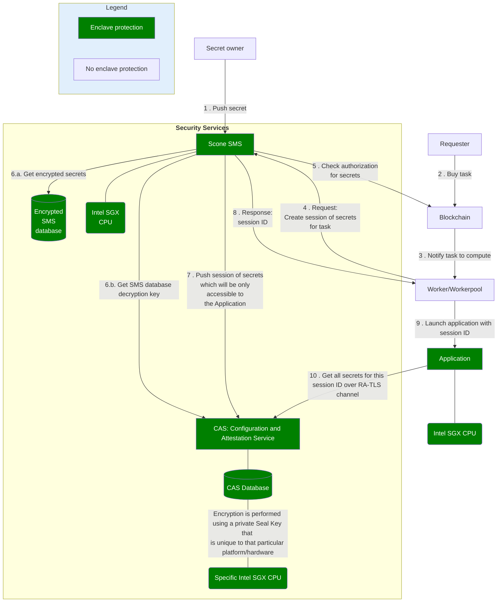

# Go to production

## Connect to the production environment

To connect to the production environment, make sure your `chain.json` content is
as follows:

```json
{
  "default": "bellecour",
  "chains": {
    "bellecour": {}
  }
}
```

Do not forget to target a production workerpool when running a production
application:

```bash
iexec app run <0x-your-app-address> \
    --workerpool prod-v8-bellecour.main.pools.iexec.eth \
    [...]
```

## Standard application

If you are developing a standard application, then you are already set.

## Confidential Computing application

::: warning

The following applies only to the Scone framework.

:::

If you are developing a Confidential Computing application, be aware of
following information.

### Sign your application

Any Confidential Computing application built previously on the
[develop environment](confidential-computing/intel-sgx-technology.md) runs in a
debug enclave, which, as warned, might be inspected.

To run your application in a production enclave, the application needs to be
signed with a key compatible with the Intel® Attestation Service (IAS). Create
this key in your
[Intel developer Portal](https://api.portal.trustedservices.intel.com/).

When the key is created (`my-signer-key.pem`), update the previous
[sconify.sh](confidential-computing/create-your-first-sgx-app.md#build-the-tee-docker-image)
script by :

- sharing the folder containing the `my-signer-key.pem`, here `/signer`
- adding the `--scone-signer` option

```bash
docker run -it \
            -v /signer:/signer \
            [...]
            registry.scontain.com/scone-production/iexec-sconify-image:<version> \
            sconify_iexec \
            --scone-signer=/signer/my-signer-key.pem \
            [...]
```

### Impacts of the SMS in enclave

As you have already learned in previous
[confidential assets](confidential-computing/access-confidential-assets.md)
section, the iExec SMS is a crucial component for TEE tasks on iExec, being in
charge of:

- storing all secrets of iExec users (application developer, requester, dataset
  owner)
- defining - by following on-chain governance - which secrets are accessible to
  a specific enclave.

To reach a higher level of security on the production environment, the iExec SMS
runs inside an enclave.

Below is a graph showing how the secrets and session mechanism works:



As seen in this diagram, required secrets are transferred to an authorized
Application enclave over an RA-TLS channel
([Remote Attestation](https://www.intel.com/content/www/us/en/developer/tools/software-guard-extensions/attestation-services.html)).

Inside **Security Services** (yellow area in above diagram), all secrets are
protected by an SMS database encryption key, itself backed by the CAS. The SMS
enclave needs to prove its authenticity and integrity to the CAS in order to get
access to its database encryption key.

To reach a higher level of security, the CAS enclave, which is the only
component aware of the SMS database encryption key, is itself
[sealed](https://www.intel.com/content/www/us/en/developer/articles/technical/introduction-to-intel-sgx-sealing.html)
to a specific platform enclave.

With that pattern, no one, even an administrator or someone with root
privileges, can inspect confidential assets of users.

#### Backup your secrets

::: warning

Always keep a local copy of your secrets. For security reasons, it is not
possible to extract your secret from the SMS. In other words, the SMS only
allows you to share secrets securely in order to process confidential computing
tasks.

:::
