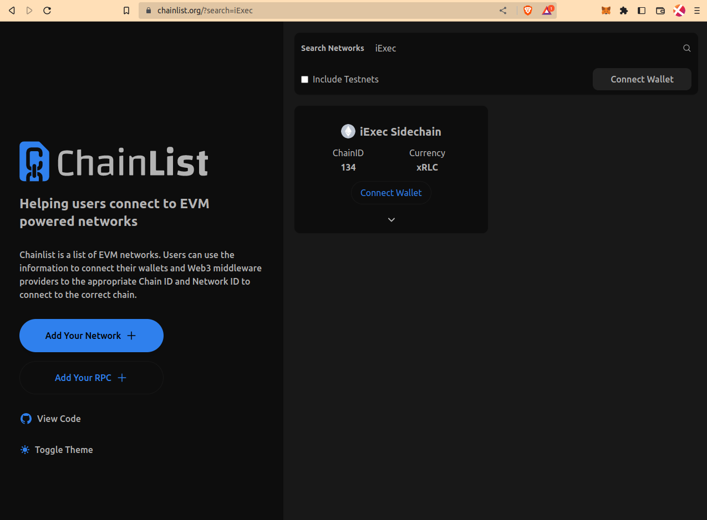
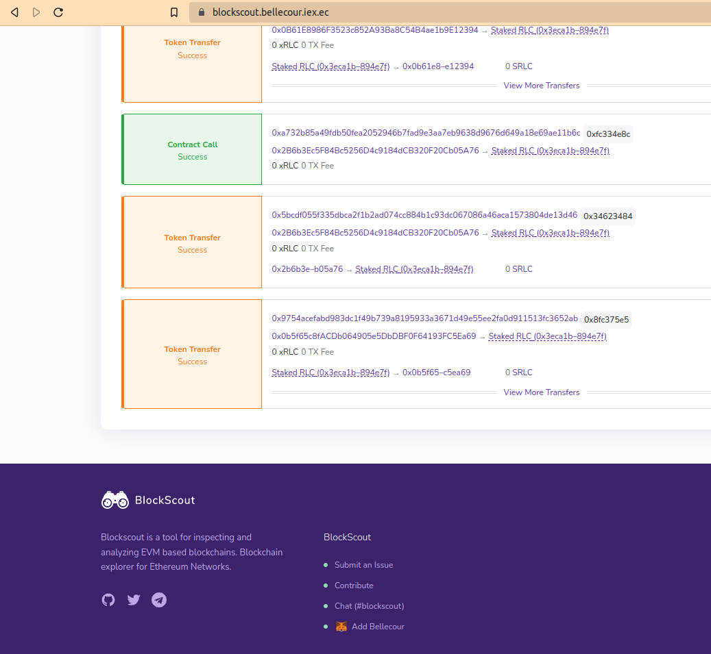
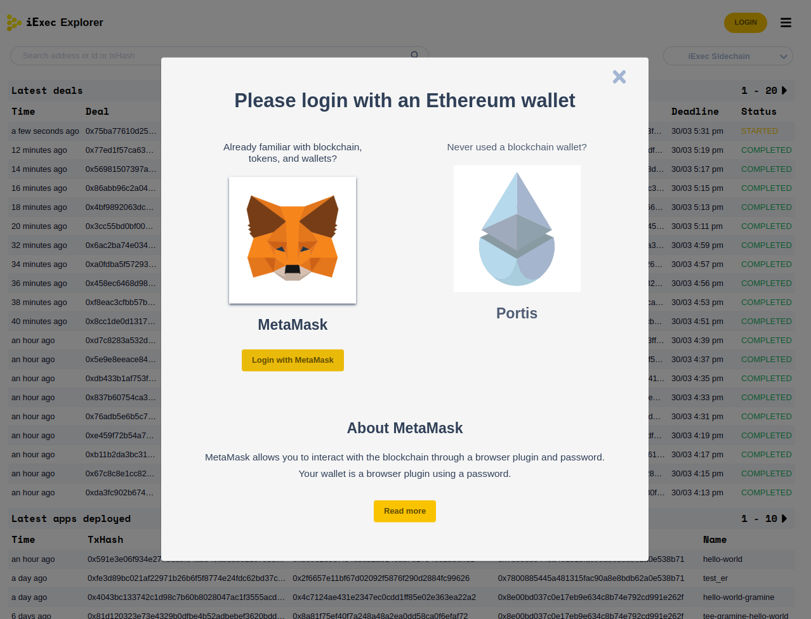
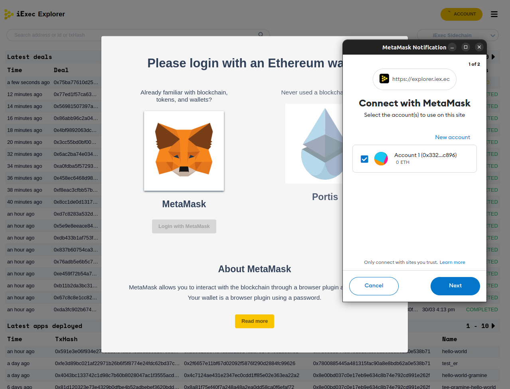
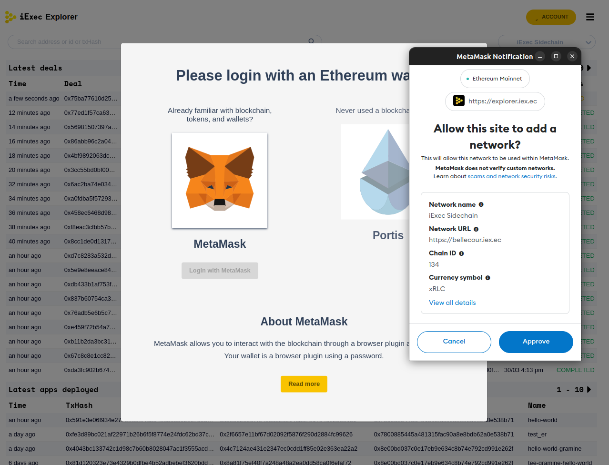
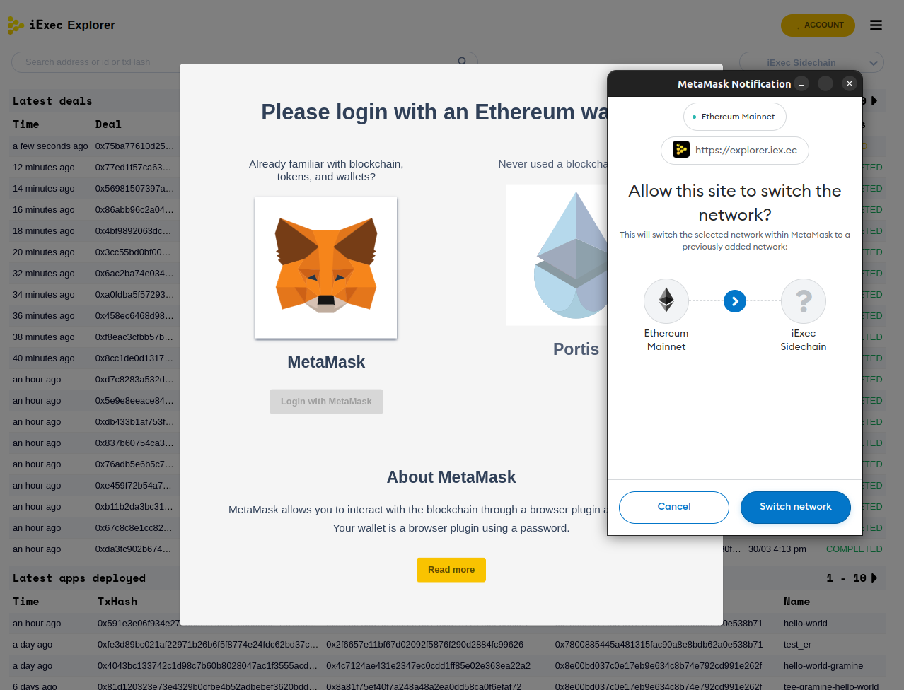
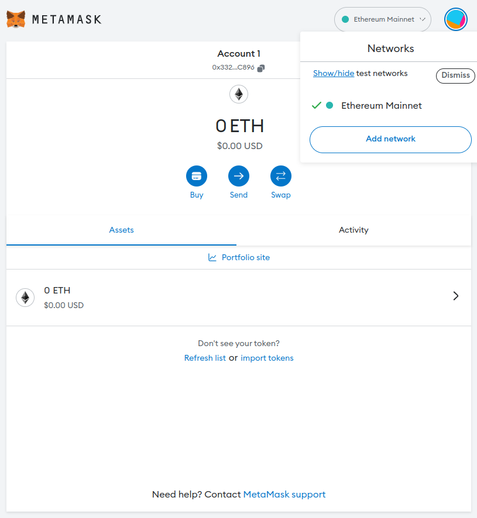
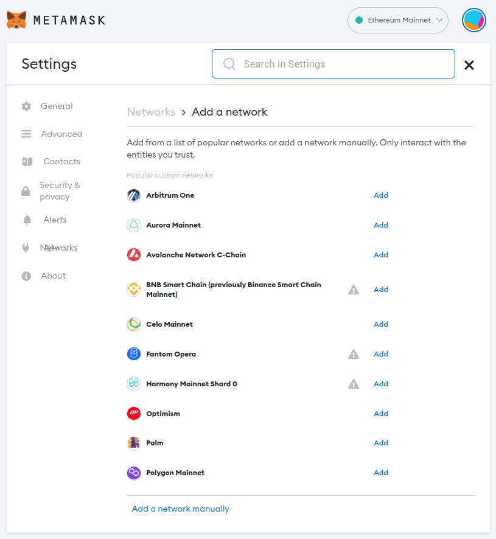
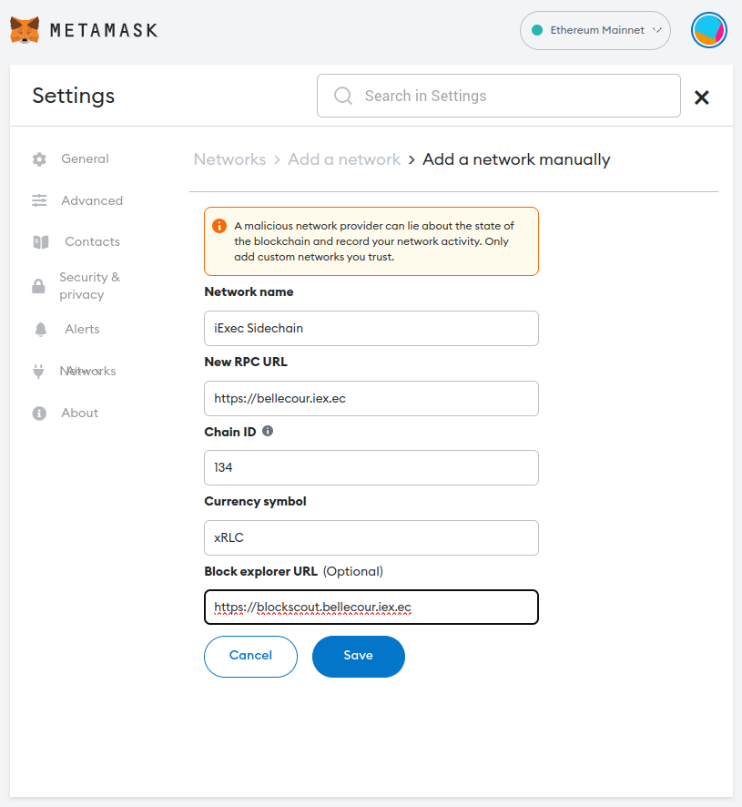

# Connect to iExec Sidechain

As mentioned in the [Overview](overview.md) section,
iExec Sidechain is EVM-compatible meaning that users can interact with it using
their existing EVM-compatible wallets (e.g. Metamask, Portis, ...etc).  
The following instructions explain how to connect to the iExec Sidechain.

## Option 1 - Chainlist

iExec Sidechain is listed on
[https://chainlist.org](https://chainlist.org/?search=iExec). Users are able to
easily add the network to their wallets through this website.

## Option 2 - Blockscout

iExec Sidechain could also be added to wallets directly from its explorer
<https://blockscout.bellecour.iex.ec>.

## Option 3 - iExec account manager

iExec account manager is available across multiple iExec products. When used for
the first time, it allows users to add iExec Sidechain to the network list of
their wallets.

## Option 4 - Manually on Metamask

Open Metamask and click on **Add network**

Select **Add a network manually**

Enter the following chain details and click on **Save**:

- Network name: iExec Sidechain
- New RPC URL: <https://bellecour.iex.ec>
- Chain ID: 134
- Currency symbol: xRLC
- Block explorer URL: <https://blockscout.bellecour.iex.ec>

