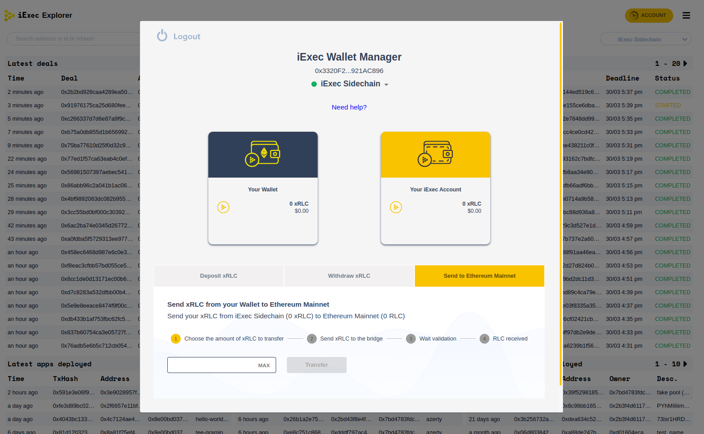

# Overview

iExec sidechain, aka **Bellecour**, is a Proof of Authority Blockchain that aims
at scaling the underling infrastructure of iExec's off-chain/confidential
computing platform. It is linked to Ethereum Mainnet with a bridge that enables
sending [RLC](https://iex.ec/rlc-token/) tokens in both directions.

- **Explorer**: <https://blockscout.bellecour.iex.ec>
- **Netstats**: <https://netstats.bellecour.iex.ec>

## Key features & highlights

- **EVM-compatibility**: Bellecour is an EVM-compatible chain so there is no
  need to modify contracts in order to deploy them on the sidechain.
- **Block time**: a block is sealed every 5 seconds which is, on average 3 times
  faster than Ethereum Mainnet.
- **Block size**: `6,700,000` gas limit per block.
- **Gas price**: No transaction fees are applied.

## Validators

Currently, the Sidechain is running with 8 validators, some of them are not
controlled by iExec which makes the chain more decentralized and resilient. The
governance of the chain is managed through ballots and votes.

### Governance Dapps

- Voting: <https://voting.bellecour.iex.ec>
- Validators: <https://validator.bellecour.iex.ec>
- Ceremony: <https://ceremony.bellecour.iex.ec>

## Whitelisting

By default, all operations related to iExec's Marketplace such as deploying
Dapps/Datasets/Workerpools and running tasks are allowed without any
authorization. However, developers who want to deploy custom Smart Contracts
need to send a whitelisting request using the following
[link](https://iexecproject.atlassian.net/servicedesk/customer/portal/4/group/9/create/66).

## Bridge

Tasks on iExec's off-chain/confidential computing marketplace are paid with
ERC20 RLC tokens. Users wanting to interact with the platform need to bridge RLC
tokens from Ethereum Mainnet to the Sidechain.

Tokens on the Sidechain are directly linked to RLC token on Ethereum Mainnet. No
new tokens are created on the Sidechain without locking the equivalent on
Mainnet. The bridging operation follows the **lock & mint / burn & unlock**
principle. When sending tokens from Mainnet to Bellecour, the bridge **locks**
the initial amount on the source chain and **mints** the equivalent on the
destination chain. When going in the other direction, it **burns** tokens on the
Sidechain and **unlocks** the same amount on Mainnet. The bridged asset is
called xRLC on Bellecour.

```text
1 RLC = 1 xRLC
```

It is to be noted that `RLC` is an ERC-20 token on mainnet while `xRLC` is the
native token of the Sidechain.

Users can send tokens from the Ethereum Mainnet to the iExec Sidechain or
vice-versa using the **Account Manager** available across all iExec products.


