# iExec explorer

The iExec explorer is a high level protocol explorer that allows to quickly
browse iExec protocol.

The iExec explorer is available at <https://explorer.iex.ec>.

## Protocol overview

The iExec explorer home page gives a quick overview of the protocol recent
activity.

- The latest [Deals](#deal) and [Tasks](#task) running on the platform
- The latest [Apps](#app), [Datasets](#dataset) and [Workerpools](#workerpool)
  deployed

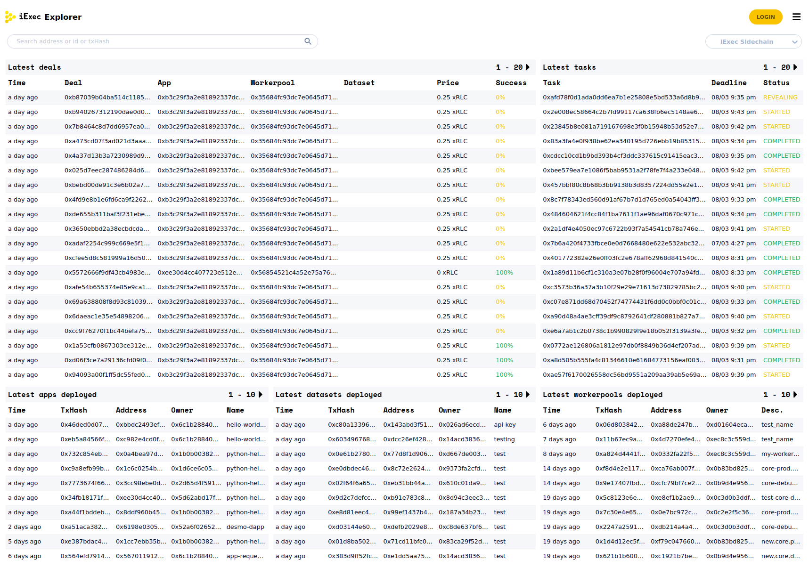

## Login

The **Login** button allows to connect your ethereum wallet to the application.

Connecting your wallet allows to [interact](#actions) with the protocol in the
application.

### Account

Once connected with a wallet, the **Account** button allows to open the account
modal, from where the user can manage her/his wallet and iExec account.

### My activity

Once connected, the **My activity** button allows the user to quickly navigate
to her/his wallet [address details](#address) page.

## Navigation

### Search bar

The search bar allows to find an item by its address, ENS name or transaction
hash.

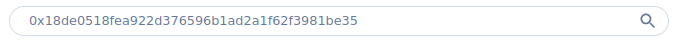

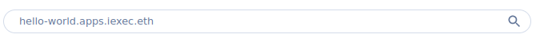

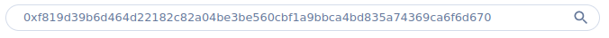

### Links

Each item can be clicked to access its [detailed view](#detailed-views).

### Block explorer links

For a low level view, an external link to a
[block explorer](https://blockscout-bellecour.iex.ec/) is available on addresses
and transactions.

## Detailed views

The following items have a detailed view.

- [Address](#address)
- [App](#app)
- [Dataset](#dataset)
- [Workerpool](#workerpool)
- [Deal](#deal)
- [Task](#task)
- [Transaction](#transaction)

### Address

This page summarizes the interactions of an ethereum address with the protocol.

Specific role based views (such as Requester, [Worker](#worker-view), App
developer, Dataset provider, Workerpool manager) are available on this page.

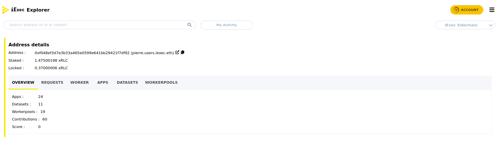

#### Worker view

The worker view shows the wallet activity as a worker.

The worker's latest contributions on tasks are exposed with their current
status.

| Status      | Description                                                                                                            |
| ----------- | ---------------------------------------------------------------------------------------------------------------------- |
| CONTRIBUTED | the worker submitted the computation result on the blockchain but the task is not finalized yet                        |
| PROVED      | the worker contribution was in the consensus when the task was finalized  - the worker has been rewarded           |
| REJECTED    | the worker contribution was not in the consensus when the task was finalized  - the worker's stake has been seized |

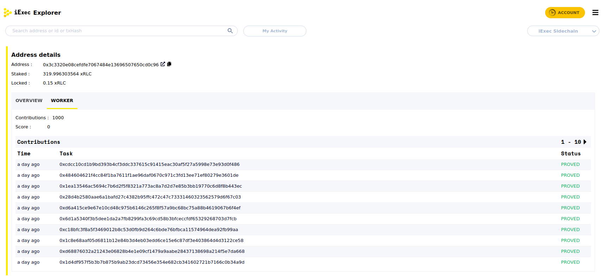

### App

This page shows the details of an app and its latest usages.

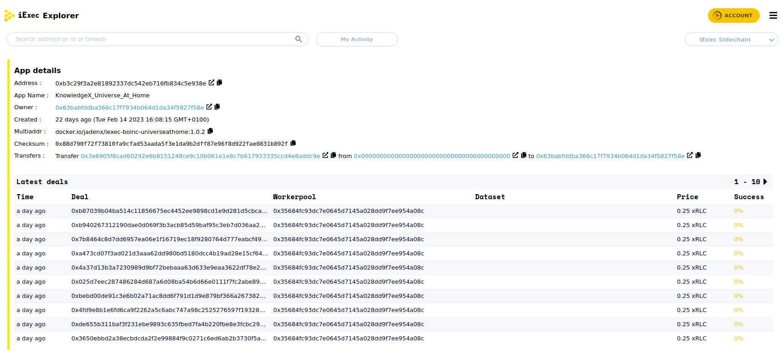

### Dataset

This page shows the details of a dataset and its latest usages.

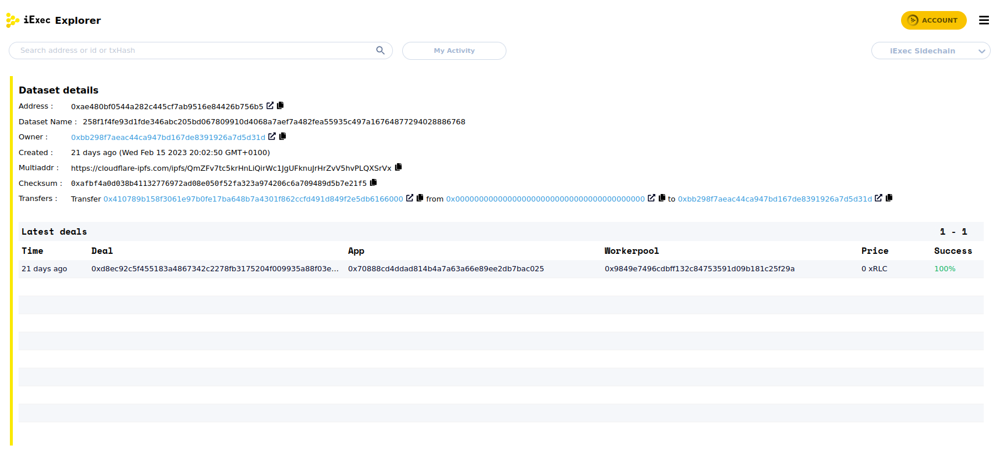

### Workerpool

This page shows the details of a workerpool and its latest usages.

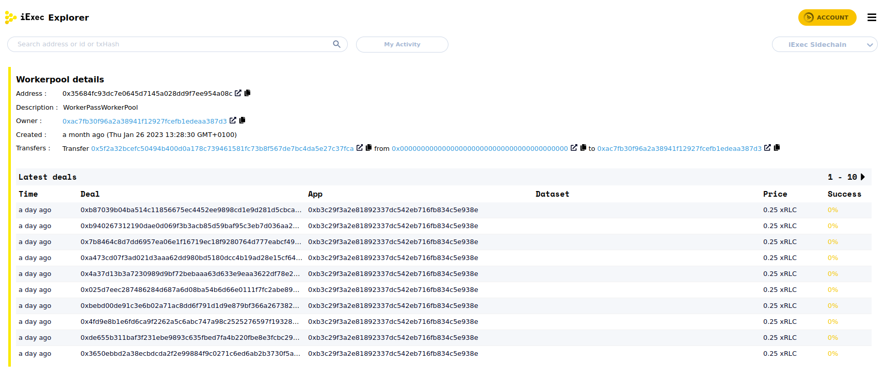

### Deal

This page shows the details of a deal and the generated computation
[tasks](#task).

The `Status` shows a synthetic information of the deal's tasks completion.

| Status    | Description                                                                       |
| --------- | --------------------------------------------------------------------------------- |
| PENDING   | tasks not COMPLETED while the deadline is not reached yet                         |
| COMPLETED | tasks successfully COMPLETED                                                      |
| CLAIMABLE | tasks not finalized before the deadline  - not finalized tasks can be claimed |
| CLAIMED   | tasks not finalized before the deadline and claimed as failed                     |

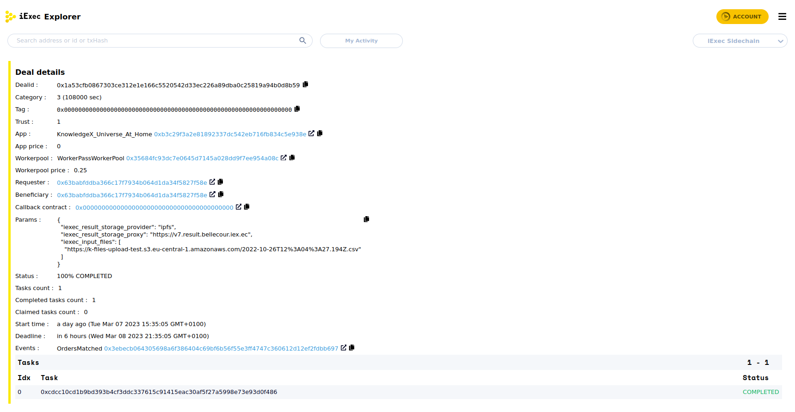

### Task

This page shows the details of a task and its completion status.

| Status    | Description                                                                                                                                                                                                                             |
| --------- | --------------------------------------------------------------------------------------------------------------------------------------------------------------------------------------------------------------------------------------- |
| STARTED   | the task was initialized and waiting for worker's contributions  - this status is displayed in red when the deadline is reached, the task can be claimed                                                                            |
| REVEALING | the task received enough contributions to reach the [PoCo](../../key-concepts/proof-of-contribution.md) consensus but is not yet finalized  - this status is displayed in red when the deadline is reached, the task can be claimed |
| COMPLETED | the task is successfully finalized  - resource providers have been rewarded                                                                                                                                                         |
| CLAIMED   | the task was not `COMPLETED` before the deadline and was claimed as failed.  - the workerpool stake has been seized  - the requester has been refunded                                                                          |

Once the task status is `COMPLETED`, the result is available

- on chain if a callback contract has been specified
- off-chain as a downloadable archive if no callback contract was specified

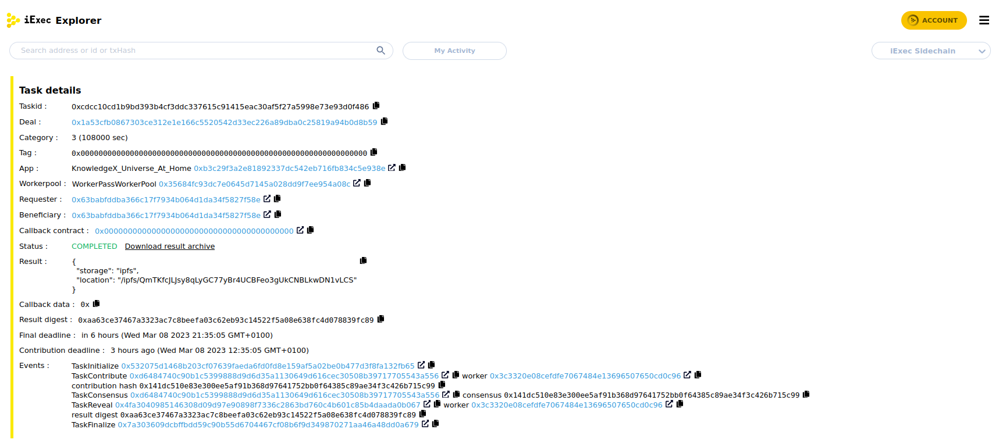

### Transaction

This page shows the detail of a transaction on the protocol smart contracts.

::: info

Transactions that does not impact the protocol are not indexed in the explorer.

To inspect any transaction on iExec Bellecour sidechain, use a block explorer
such as [Blockscout](https://blockscout-bellecour.iex.ec/)

:::

The protocol related ethereum events triggered by the transaction are exposed.

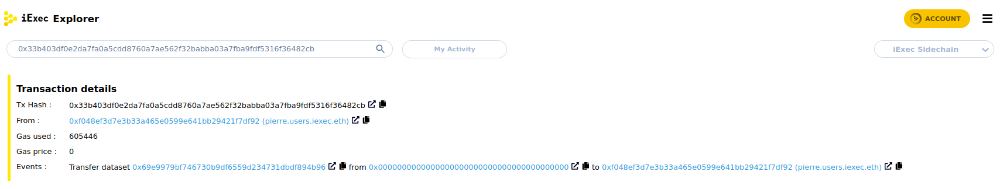

## Actions

| Action          | Access                    | Description                                                                                                                                                                          |
| --------------- | ------------------------- | ------------------------------------------------------------------------------------------------------------------------------------------------------------------------------------ |
| Deposit         | [Account modal](#account) | Send a transaction to transfer RLC/xRLC from the user wallet to the user account  - tokens in user account can be used on the platform                                           |
| Withdraw        | [Account modal](#account) | Send a transaction to transfer RLC/xRLC from the user account to the user wallet  - tokens in user wallet can be traded outside the platform                                     |
| Download result | [Task](#task)             | Download the result archive of a `COMPLETED` task (Download is not available for tasks with onchain callback)                                                                        |
| Claim task      | [Task](#task)             | Send a transaction to claim a task as `CLAIMED`  - claiming a task will unlock the escrowed tokens for requester and workers while the workerpool escrowed tokens will be seized |
| Claim deal      | [Deal](#deal)             | Send one or multiple transactions to claim some deal's tasks as `CLAIMED` (see, Claim task)                                                                                          |
